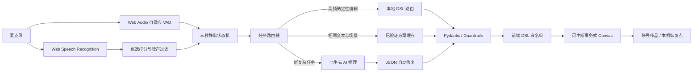

# 设计文档：AI 纯语音绘图工具竞赛增强版 4.1

## 1. 题目理解

题目要求用户不能依赖鼠标或键盘完成绘图创作，并重点考察：

1. 指令理解的准确性与容错性；
2. 语音到绘图操作的响应延迟；
3. 复杂指令的拆解与执行能力；
4. 计划支持能力、最终实现能力及未完成原因。

本项目将“纯语音”定义为：首次浏览器麦克风授权之后，创作、修改、中断、撤销、保存、恢复和系统检查不再需要鼠标或键盘。首次授权属于浏览器安全边界，网页不能绕过。

## 2. 总体架构



## 3. 计划支持的指令能力

### 3.1 创作类

- 风景、人物、动物、建筑、海报、流程图和抽象图形；
- 数量、颜色、位置、大小、层次、前后关系与整体氛围；
- 渐变背景、文字标注和组合对象；
- 在已有画面中继续增加内容。

### 3.2 编辑类

- 移动：左右上下，可指定像素；
- 缩放：放大、缩小，可指定百分比或倍数；
- 旋转：顺时针、逆时针，可指定角度；
- 变色、删除、清空；
- 一句话组合多个编辑步骤；
- 同类对象消歧：第一个、第二个、最左、最右、最大、最小、所有。

### 3.3 系统控制类

- 开始记录、静默 3 秒自动提交、立即绘图；
- 停止并回滚、撤销、重做；
- 保存 PNG、保存账号作品、打开上次作品；
- 恢复本机现场、重复上次描述；
- 朗读状态、语音帮助、系统自检；
- 暂停和恢复监听。

## 4. 最终已实现能力

### 4.1 多信号语音输入

系统同时使用：

- SpeechRecognition interim/final 文本；
- Web Audio Analyser 的 RMS 音量；
- 自适应环境噪声基线；
- 最多 5 个语音候选及浏览器置信度。

候选文本会综合置信度、绘图领域词、文本长度和噪声词惩罚进行排序。“嗯、啊、哦、那个”等单独噪声不会进入绘图描述；重复 final 片段会去重。

### 4.2 三秒静默结束

- 只有已经记录到有效文本时才启动倒计时；
- interim、final 和 VAD 音量都会刷新最后活动时间；
- 每次语音活动递增版本号，旧计时器无法提交新内容；
- 连续静默 3 秒后自动提交；
- “立即绘图”可跳过等待；
- “继续描述”可重新开始倒计时。

### 4.3 三路执行架构

#### 本地低延迟路由

适用于移动、缩放、旋转、变色、删除和清空。只有所有子句都能可靠解析时才接管，否则整体回退 AI，避免只执行半句。

#### 已验证方案缓存

复杂任务成功后，以“语音文本 + 画布尺寸 + 当前场景摘要”生成哈希键，保存已通过 Pydantic 与 Guardrails 的 DrawingPlan：

- TTL 默认 900 秒；
- LRU 默认最多 128 条；
- 命中后跳过远程模型；
- 读取时深拷贝，避免执行过程修改缓存对象。

#### AI 复杂规划

新场景、复杂关系和风格化表达由 AI 生成：

- `intent`；
- `confidence`；
- `execution_steps`；
- `operations`。

模型输出不合法时进行一次结构修复，再重新校验。

### 4.4 对象选择与消歧

目标对象通过以下信息联合匹配：

- `id`；
- `group_id`；
- `label`；
- `tags`；
- `bbox`。

当画面中存在多个“云朵”时，可理解：

- 最左边的云朵；
- 最右边的云朵；
- 第二个云朵；
- 最大的云朵；
- 所有云朵。

### 4.5 安全 Drawing DSL

后端只允许：

- background；
- create；
- transform；
- recolor；
- delete；
- clear。

图元只允许 circle、ellipse、rect、line、polygon、polyline、bezier、arc、text。Guardrails 限制坐标、尺寸、颜色、透明度、线宽、操作数、ID 和编辑目标。

前端还会再次执行操作与图元白名单检查，形成后端和浏览器双重防线。

### 4.6 网络与延迟优化

- 复用一个 `httpx.AsyncClient`，减少 TCP/TLS 建连；
- 连接超时与总超时分离；
- 429、5xx 和网络抖动采用有限指数退避；
- 系统命令和确定性编辑不调用模型；
- 重复复杂任务可命中验证缓存；
- 页面展示执行路径、后端总耗时和拆解步骤。

### 4.7 事务式执行和故障恢复

每次任务开始前保存画布快照。以下情况均回滚：

- 用户说“停止”；
- AI 请求超时；
- 网络错误；
- DSL 客户端白名单失败；
- Canvas 执行异常。

成功绘制、撤销、重做和清空后，会保存按用户隔离的本机恢复点。页面刷新或异常退出后可说“恢复现场”。

### 4.8 用户、作品与管理后台

已实现：

- 注册、登录与角色跳转；
- MySQL / SQLite；
- 用户封禁与使用次数；
- 作品 JSON 保存和恢复；
- 请求限流；
- 成功率、平均延迟、本地 / AI / 缓存 / 语音V2 路由量；
- 最近调用记录与作品数量。

### 4.9 赛前系统自检

`/api/preflight` 检查：

- FastAPI 后端；
- 数据库；
- AI Key 是否已配置；
- 本地路由；
- 方案缓存。

前端再补充浏览器语音识别和麦克风状态。用户可直接说“系统自检”获取语音报告。

## 5. 准确性与容错策略

1. 多候选领域打分；
2. 识别置信度展示；
3. 近音纠错；
4. 低信息量噪声过滤；
5. final 去重；
6. 文本 + 音量双信号静默判断；
7. 旧计时器版本锁；
8. 当前场景摘要和 group_id；
9. 空间与序号消歧；
10. 保守本地路由；
11. AI JSON 自动修复；
12. Pydantic、Guardrails 和前端白名单；
13. 停止、错误和超时统一回滚；
14. 语音服务异常指数退避重连。

## 6. 复杂指令拆解策略

### 6.1 本地确定性编辑

按“然后、接着、并且、同时、逗号”等切分子句，每个子句依次完成：

1. 目标对象与指代解析；
2. 同类对象空间/序号消歧；
3. 操作类型识别；
4. 数量、方向、颜色和角度解析；
5. DSL 生成；
6. 全句完整性检查。

### 6.2 AI 创作

模型根据画布尺寸、当前场景摘要、用户语音和 JSON Schema 生成背景、主体、细节与编辑操作，并通过 `execution_steps` 展示可解释步骤。

## 7. 未完成部分与原因

### 7.1 首次授权完全无点击

未绕过浏览器麦克风授权。原因是这是 Chrome/Edge 的安全边界。比赛 kiosk 脚本可减少现场步骤，但公开网页不应规避权限。

### 7.2 真正后端流式 DSL

当前拿到完整 JSON 后再逐步绘制。未采用 token 级流式落图，因为未闭合 JSON 难以可靠校验，也无法保证事务回滚一致性。

### 7.3 照片级绘画

当前 DSL 更适合卡通、简笔画、海报、几何图和场景草图，不适合照片纹理、复杂笔刷和真实 3D。

### 7.4 多模态看图再编辑

尚未实现上传图片后语音修改。题目核心是语音到绘图操作，本版本优先保证纯语音闭环、延迟、拆解和稳定性。

### 7.5 真实语音识别准确率统一百分比

未虚构统一准确率。浏览器识别结果受麦克风、网络、口音与环境影响。项目只提供可重复的文本路由基准，并明确其边界。

## 8. 测试与验收

自动化测试覆盖：

- 注册、登录、认证和封禁；
- 使用次数与管理员指标；
- Guardrails；
- 本地多步骤编辑；
- 同类对象空间和序号消歧；
- 不确定指令回退 AI；
- 作品保存与恢复；
- AI JSON 自动修复；
- 已验证方案缓存与深拷贝；
- 赛前自检接口。

运行：

```bash
pytest -q
python benchmarks/evaluate_command_router.py
```

当前结果：21 项测试通过，离线路由基准 19/19 通过。

## 9. 结论

本项目不是简单的“语音转文字后调用模型”，而是形成了语音状态机、候选打分、VAD、三路执行、对象消歧、结构化 DSL、自动修复、双重安全校验、事务回滚、现场恢复和管理指标的完整链路，直接对应题目对准确性、容错性、响应延迟和复杂指令执行能力的要求。
